# Skill 依赖图谱

本文档描述了各 Skill 之间的调用关系和依赖关系，帮助理解 Skill 体系的协作机制。

## 📊 依赖关系总览

```mermaid
graph TD
    subgraph "00 元调度层"
        META[00_Meta_Dispatcher]
        TEAM[00_Meta_UniversalDevTeam]
    end
    
    subgraph "01 产品架构层"
        BRAIN[01_ProductManager_Brainstorming]
        TECH[01_Architect_TechStackSelector]
        GITHUB[01_Discovery_GitHubSearch]
    end
    
    subgraph "02 设计层"
        API[02_Architect_APIDesign]
        FRONT[02_Designer_FrontendImplementation]
        UIUX[02_Designer_UIUXIntelligence]
        WEB[02_Designer_WebGuidelines]
    end
    
    subgraph "03 开发层"
        FLUTTER[03_Mobile_Flutter]
        FLUTTER_CN[03_Mobile_FlutterChinaDeploy]
        REACT[03_Developer_ReactBestPractices]
        ARTIFACTS[03_Developer_ArtifactsBuilder]
    end
    
    subgraph "04 测试层"
        BROWSER[04_Tester_BrowserAutomation]
    end
    
    subgraph "05 后端运维层"
        DB[05_Backend_Database]
        PYTHON[05_Backend_Python]
        NODE[05_Backend_Node]
        MCP[05_Backend_MCPBuilder]
        GITOPS[05_DevOps_GitOps]
        GITFLOW[05_DevOps_GitWorkflow]
        GITEE[05_DevOps_GiteeWorkflow]
    end
    
    subgraph "06 办公层"
        DOCX[06_Office_Docx]
        EXCEL[06_Office_Excel]
        PDF[06_Office_Pdf]
    end
    
    subgraph "07-09 专业层"
        SEC[07_Security_Specialist]
        AI[08_AI_Engineer]
        OPS[09_Operations_Growth]
    end
    
    subgraph "99 元技能层"
        CREATOR[99_Meta_SkillCreator]
        CUSTOM[99_Meta_Customization]
    end
    
    META --> BRAIN
    META --> TECH
    META --> FLUTTER
    META --> AI
    
    TEAM --> BRAIN
    TEAM --> API
    TEAM --> WEB
    TEAM --> FLUTTER
    TEAM --> REACT
    TEAM --> PYTHON
    TEAM --> GITOPS
    TEAM --> OPS
    
    TECH --> API
    TECH --> DB
    
    BRAIN --> TECH
    
    FRONT --> UIUX
    FRONT --> WEB
    
    ARTIFACTS --> UIUX
    ARTIFACTS --> REACT
    
    FLUTTER --> FLUTTER_CN
    
    PYTHON --> DB
    NODE --> DB
    
    AI --> PYTHON
    AI --> DB
```



## 🔄 典型协作流程

### 1. 新项目启动流程

```
用户需求 → 00_Meta_Dispatcher
    ↓
01_ProductManager_Brainstorming (需求分析)
    ↓
01_Architect_TechStackSelector (技术选型)
    ↓
┌─────────────────────────────────────┐
│  根据选型结果路由到具体实现 Skill:  │
│  - 03_Mobile_Flutter (移动端)       │
│  - 03_Developer_ReactBestPractices  │
│  - 05_Backend_Python (后端)         │
│  - 02_Designer_FrontendImplementation│
└─────────────────────────────────────┘
```

### 2. 前端开发流程

```
UI 需求 → 02_Designer_UIUXIntelligence (设计系统生成)
    ↓
02_Designer_FrontendImplementation (UI 实现)
    ↓
02_Designer_WebGuidelines (规范检查)
    ↓
04_Tester_BrowserAutomation (自动化测试)
```

### 3. 后端开发流程

```
API 需求 → 02_Architect_APIDesign (API 设计)
    ↓
05_Backend_Python / 05_Backend_Node (实现)
    ↓
05_Backend_Database (数据库设计)
    ↓
04_Tester_BrowserAutomation (API 测试)
```

## 📋 Skill 依赖矩阵

| Skill | 依赖 | 被依赖 |
|-------|------|--------|
| 00_Meta_Dispatcher | - | 所有 Skill |
| 00_Meta_UniversalDevTeam | - | 所有 Skill |
| 01_ProductManager_Brainstorming | - | META, TEAM |
| 01_Architect_TechStackSelector | BRAIN | META, TEAM |
| 01_Discovery_GitHubSearch | - | 所有开发 Skill |
| 02_Architect_APIDesign | - | TECH, TEAM |
| 02_Designer_UIUXIntelligence | - | FRONT, ARTIFACTS |
| 02_Designer_FrontendImplementation | UIUX, WEB | TEAM |
| 02_Designer_WebGuidelines | - | FRONT, TEAM |
| 03_Mobile_Flutter | FLUTTER_CN | META, TEAM |
| 03_Mobile_FlutterChinaDeploy | - | FLUTTER |
| 03_Developer_ReactBestPractices | - | ARTIFACTS, TEAM |
| 03_Developer_ArtifactsBuilder | UIUX, REACT | - |
| 04_Tester_BrowserAutomation | - | 所有前端 Skill |
| 05_Backend_Database | - | PYTHON, NODE, AI |
| 05_Backend_Python | DB | AI, TEAM |
| 05_Backend_Node | DB | TEAM |
| 05_Backend_MCPBuilder | - | - |
| 05_DevOps_GitOps | - | TEAM |
| 05_DevOps_GitWorkflow | - | TEAM |
| 05_DevOps_GiteeWorkflow | - | TEAM |
| 06_Office_Docx | - | - |
| 06_Office_Excel | - | - |
| 06_Office_Pdf | - | - |
| 07_Security_Specialist | - | 所有 Skill |
| 08_AI_Engineer | PYTHON, DB | META |
| 09_Operations_Growth | - | TEAM |
| 99_Meta_SkillCreator | - | - |
| 99_Meta_Customization | - | - |

## 🎯 按场景选择 Skill

| 场景 | 推荐 Skill 组合 |
|------|----------------|
| 新项目启动 | META + BRAIN + TECH |
| 移动端开发 | FLUTTER + FLUTTER_CN + UIUX |
| 前端开发 | UIUX + FRONT + WEB + REACT |
| 后端 API | API + PYTHON/NODE + DB |
| AI 应用 | AI + PYTHON + DB |
| 代码审查 | WEB + SEC + BROWSER |
| 文档处理 | DOCX + EXCEL + PDF |
| 运营推广 | OPS + DOCX |

## 📝 添加新 Skill 的依赖规则

1. **确定层级**: 根据职责分配编号前缀
2. **声明依赖**: 在 SKILL.md 中说明依赖的其他 Skill
3. **更新图谱**: 更新本文档的依赖矩阵
4. **测试协作**: 验证与依赖 Skill 的协作是否顺畅
